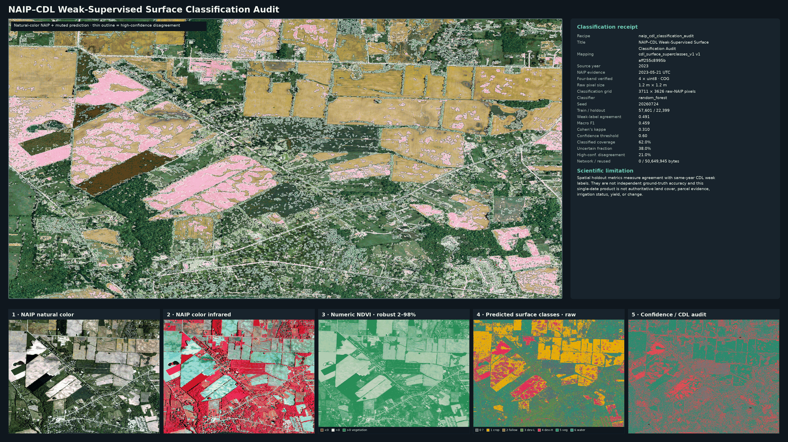

# FasterRaster

<p align="center">
  
</p>

**Deterministic raster acquisition and harmonization.**

FasterRaster turns public raster sources into bounded, reproducible, and publication-ready geospatial workflows. It compiles explicit source contracts, validates inputs, harmonizes grids, and preserves the evidence required to reproduce every output.

**Published beta:** `v1.0.0-beta.4` (`1.0.0b4`). **Current development:** `1.0.0b5.dev0` on `main`. Install the immutable release wheel for published behavior; use the checkout only for clearly labeled development capabilities.

FasterRaster is useful when a raster workflow needs more than a download script: exact source years, byte ceilings, categorical resampling rules, deterministic plans, transactional handoffs, checksums, provenance, and a clear record of what was reused or transferred.

## What the beta does

- Generates and validates Markdown study workfiles from shipped templates.
- Compiles deterministic source, acquisition, grid, and harmonization plans.
- Enforces exact-year coverage; it never silently substitutes an imagery year.
- Acquires USDA Cropland Data Layer (CDL) data for implemented studies.
- Runs multi-epoch mapped-development proxy analysis on a common valid footprint.
- Produces agricultural CDL/NAIP context workflows and bounded local execution.
- Finalizes results transactionally with manifests, receipts, checksums, and provenance.
- Replays compatible handoffs with strict zero-network `reuse: only` behavior.
- Publishes regional and deterministic 1 m hotspot human-development hybrids.
- Supports explicit interactive repair when requested NAIP coverage is
  unavailable, preserving original/resolved years, AOIs, and intervention
  evidence without weakening noninteractive fail-closed behavior.

## Capability status

The published package remains `v1.0.0-beta.4` / `1.0.0b4`. Index-guided hybrid
classification is part of that published release. Source Packs, PRISM runnable
execution, STAC v2, and Earth Engine compilation remain public development
contracts with bounded evidence; authenticated execution remains private. Bring
Your Own
Sauce, Sauce Time, reusable preview templates, CRS-aware categorical area
accounting, classification confidence provenance, coherent NAIP–CDL temporal
repair, and the public credential-requirement seam below are implemented
**Unreleased / experimental** contracts in this source tree; they are not retroactively
claimed as beta.4 features. `configs/public_capabilities.yaml` is authoritative,
and drift tests bind the CLI, website, and GPT grounding export to it.

<!-- BEGIN GENERATED CAPABILITY MATRIX -->
| Capability | Release state | Evidence | Plan | Preview | Materialize | Analyze | Public execution |
|---|---|---|:---:|:---:|:---:|:---:|---|
| Index-guided hybrid classification | `published` | `contract_validated` | yes | yes | yes | yes | `bounded_local_and_declared_sources` |
| Markdown workfiles and deterministic planning | `published` | `contract_validated` | yes | yes | yes | yes | `bounded_local` |
| Bring Your Own Sauce / declarative Source Packs | `unreleased_public` | `fixture_validated, contract_validated` | yes | yes | no | no | `validation_and_bounded_probe_only` |
| Declarative Source Pack v2 contracts | `unreleased_public` | `fixture_validated, contract_validated` | yes | yes | no | no | `frozen_contract_only` |
| Sauce Time ranked temporal alternatives | `unreleased_public` | `fixture_validated, contract_validated` | yes | no | no | no | `advisory_only` |
| Reusable preview templates | `unreleased_public` | `fixture_validated, contract_validated` | yes | yes | no | no | `render_contract_compilation` |
| CRS-aware categorical area accounting | `unreleased_public` | `fixture_validated, contract_validated` | no | yes | yes | yes | `equal_area_inventory` |
| Classification confidence-threshold provenance | `unreleased_public` | `fixture_validated, contract_validated` | yes | yes | yes | yes | `fail_closed_provenance` |
| Coherent NAIP-CDL temporal repair | `unreleased_public` | `fixture_validated, contract_validated` | yes | no | no | no | `explicit_selection_only` |
| Public credential-requirement contract | `unreleased_public` | `contract_validated` | yes | no | no | no | `fails_before_network_without_resolver` |
| Versioned generic STAC asset-access contracts | `unreleased_public` | `fixture_validated, contract_validated` | yes | no | no | no | `frozen_contract_only` |
| Closed Earth Engine computation contracts | `unreleased_public` | `contract_validated` | yes | no | no | no | `contract_compilation_only` |
| Authenticated parallel execution backend | `private` | `contract_validated` | no | no | yes | yes | `unavailable` |
| Arbitrary-code source plugins | `unsupported` | `contract_validated` | no | no | no | no | `unavailable` |
<!-- END GENERATED CAPABILITY MATRIX -->

Inspect the machine-readable matrix and exercise the offline Source Pack
journey:
```sh { .illustrative }
fr capabilities --json
fr sauce validate examples/sauce-packs/prism-daily.sauce
fr sauce explain examples/sauce-packs/prism-daily.sauce --json
fr sauce test examples/sauce-packs/prism-daily.sauce
fr preview-templates list
```

[Open the FasterRaster Flavortown Sauce Wizard](https://chatgpt.com/g/g-6a692bb17b9c8191a318997fd0435bf7-fasterraster-flavortown-sauce-wizard)
to research, draft, or audit a Source Pack from official provider evidence.
The Wizard is not the validator: checked-in schemas, the capability registry,
and the public CLI remain authoritative.

See the [Wizard workflow](docs/flavortown-wizard.md),
[Bring Your Own Sauce](docs/bring-your-own-sauce.md),
[Sauce Time](docs/sauce-time.md), and
[Preview templates](docs/preview-templates.md).

The human-development workflow uses CDL non-agricultural classes as a **crop-focused mapped-development proxy**. It is not authoritative evidence of urbanization, population or economic growth, construction dates, occupancy, cadastral approval, or causality.

## NAIP–CDL classification audit

The `naip_cdl_classification_audit` recipe acquires raw, unrendered four-band
NAIP imagery and classifies it from locally computed numeric spectral features.
Same-year USDA CDL superclasses provide weak supervision, while deterministic
spatial-block holdout, confidence and disagreement outputs, reproducible COGs,
and content-bound receipts make the result auditable. Reported metrics measure
agreement with those weak labels—not independent ground-truth accuracy.



*A finalized real-imagery publication showing the analytical classification,
source-derived views, confidence, and CDL agreement audit. Display styling does
not modify the analytical rasters.*

Create a deliberately small study, then validate and inspect its offline plan:
```sh { .illustrative }
mkdir -p studies
fr templates show ag-naip-classification
fr init studies/naip-classification.fr.md \
  --template ag-naip-classification \
  --name bounded-naip-classification \
  --bbox -83.2000 39.8500 -83.1990 39.8510 \
  --years 2023
fr validate studies/naip-classification.fr.md
fr plan studies/naip-classification.fr.md --offline
fr explain studies/naip-classification.fr.md --offline
```

Review the workfile, same-year source evidence, transfer estimate, and byte
ceiling before any live `fr cook`. Native categorical pixel counts remain
exact. Physical areas are measured on a declared equal-area grid, and the
configured confidence metric, threshold, unknown class, and threshold source
remain consistent through plans, receipts, publication evidence, and
inspection. If an exact coherent year pair is unavailable, planning ranks
explicit coherent imagery/weak-label pairs ahead of imagery-only alternatives;
nothing is silently substituted or acquired during selection. See the
[classification methodology and interpretation guide](docs/ag-classification.md).

## Index-guided hybrid classification

The published beta.4 contract adds first-class spectral indices and an additive
`naip_cdl_index_hybrid_classification_audit` recipe. The broad CDL-weakly
supervised classifier remains independently inspectable. Specialist index
classes then refine only declared parent classes using fixed thresholds,
Boolean rules, explicitly normalized weighted scores, or target spectral
similarity. Arbitration is deterministic, and the general classification,
specialist candidates/scores, final hybrid classes, and decision state remain
separate artifacts.

The shipped development recipe demonstrates vigorous-vegetation and
wet-surface candidates from four-band NAIP. For example, a vegetation
specialist can require both NDVI and GNDVI thresholds within cropland or
noncrop-vegetation parents. These are scene-relative spectral rules, not
independent ground truth.

Discover compatible definitions before editing a workfile:
```sh { .illustrative }
fr indices list
fr indices show ndvi
fr templates show ag-naip-index-hybrid-classification
```

Recommendation mode ranks a bounded, spatially validated candidate set.
Noninteractive execution produces an `AWAITING_INDEX_SELECTION` review package
and does not finalize. Automatic selection requires explicit workfile
authorization and stops when support or performance guards are not met. See
the [index-guided classification guide](docs/index-guided-classification.md)
for the complete contract, examples, outputs, and scientific limitations.

## FasterRaster Cook Expert

Need help translating a geospatial objective into a FasterRaster cook?

The [FasterRaster Cook Expert](https://chatgpt.com/g/g-6a667954b08c8191a6b827ae9cf84897-fasterraster-cook-expert) is a public ChatGPT assistant trained on FasterRaster's public documentation, schemas, source catalog, CLI reference, and example workfiles.

It can help you:

- explain FasterRaster terminology such as cooks, workfiles, recipes, source contracts, adapters, preflight, receipts, handoffs, specialists, and arbitration;
- turn a GIS or remote-sensing objective into a complete `.fr.md` workfile;
- assemble complex agricultural, classification, index-guided, imagery, climate, and multi-source cooks;
- explain each field and scientific decision in plain language;
- review an existing cook for unsupported fields, incompatible sources, or overly broad scientific claims;
- provide the public CLI commands needed to validate, plan, cook, inspect, and publish the workflow;
- interpret public manifests, receipts, validation reports, and completed handoffs.

[Open the FasterRaster Cook Expert →](https://chatgpt.com/g/g-6a667954b08c8191a6b827ae9cf84897-fasterraster-cook-expert)

> **Review before execution:** The assistant generates and explains public FasterRaster configurations, but it does not execute the cook for you. Validate the generated workfile with `fr validate`, inspect its plan, confirm source and byte-budget decisions, and review the scientific limitations before enabling network access.
>
> The assistant is grounded only in documented public FasterRaster capabilities. It does not describe or provide access to private integrations, managed infrastructure, proprietary execution systems, or undocumented features.

## Five-minute offline start

Prerequisites are Python 3.12, a working GDAL/Rasterio runtime, and Git. Ubuntu is the public CI platform; WSL2 is exercised during local release validation. macOS and native Windows may work but are not beta CI targets yet.
```sh { .illustrative }
python3.12 -m venv .venv
. .venv/bin/activate
python -m pip install .

fr --version
fr doctor --offline
fr templates list

mkdir -p studies
fr init studies/meridian.fr.md \
  --template human-development-cdl \
  --name meridian-cdl-development \
  --bbox -116.45 43.58 -116.35 43.68 \
  --years 2008 2016 2021

fr validate studies/meridian.fr.md
fr plan studies/meridian.fr.md --offline --out build/meridian-plan
```

Those commands make no network requests and write the deterministic plan beneath `build/meridian-plan/`. Review the generated workfile before enabling network access.

To install the current development wheel instead (not the published beta.4 artifact):

```sh
python -m pip install dist/faster_raster-1.0.0b5.dev0-py3-none-any.whl
```

See [Installation](docs/installation.md) and the [five-minute quickstart](docs/quickstart.md) for clean-environment and live-study instructions.

## Normal CLI lifecycle

```text
doctor
  → templates
  → init
  → validate
  → plan
  → cook
  → inspect
  → publish
  → reuse-only verification
```

`validate` is offline. `plan --offline` prohibits even bounded source refresh. A live `cook` requires network permission in the workfile and remains subject to its byte ceiling. `reuse: auto` reuses verified compatible data and may acquire missing inputs when permitted; `reuse: only` makes zero network requests and fails closed if compatible evidence is missing; `reuse: never` deliberately reacquires data.

Final handoffs are written to `outputs/handoffs/<handoff-id>/`. Human-development publications are written to `outputs/publications/<publication-id>/`. Staging and failed directories are not finalized results. Use `fr inspect latest --verbose`, then verify `checksums.sha256` from inside the selected handoff or publication.

## Canonical visual example


*Buckeye–Verrado, Arizona: CDL analytical years 2008, 2016, and 2021. The natural-color layer is 2023 NAIP visual context because no intersecting 2021 NAIP catalog records were available; it is not evidence of conditions in 2021. The classification is a CDL-derived mapped-development proxy with the limitations stated above.*

The [examples gallery](docs/examples.md) also includes Star, Idaho, where 2021 NAIP context matches the latest CDL analytical year.

## Sources and scope

Implemented beta paths include live USDA CDL acquisition; USGS NAIP context; bounded 3DEP use where a recipe requires it; bounded local workers; and offline compiler/evidence paths for the shipped public-source contracts. The static HTTP range wave includes CHIRPS, gridMET, TerraClimate, WorldClim, and PRISM daily precipitation bounded probes. PRISM uses a deterministic official daily ZIP path and can be materialized as a complete, content-addressed object after matching live probe evidence and explicit approval. Its product pipeline safely inventories the archive, streams only the selected date-matched GeoTIFF, promotes that raster content-addressably, validates Rasterio decoding and declared COG structure, and cross-checks the provider projection, statistics, processing information, and FGDC metadata. AOI subsetting and deterministic target-grid COG execution are implemented. The guarded normal-workfile `prism_dem_ndvi_correlation_audit` workflow combines bounded PRISM accumulation, USGS 3DEP elevation, numeric NDVI derived from raw four-band NAIP, and same-year CDL context; see [PRISM × DEM × NDVI correlation audit](docs/prism-dem-ndvi-correlation.md).

Exact-year behavior is strict. If a requested NAIP year has no intersecting records, FasterRaster reports the available intersecting years and stops. The user must explicitly choose another year. The Buckeye recovery from requested 2021 context to explicitly selected 2023 context demonstrates that contract; it is not silent substitution.

A guarded maintainer canary is available as `fr-prism-canary`. Plan-only use requires `--allow-network`, compiles the task, performs bounded source validation, and writes a materialization plan. Complete-object execution additionally requires `--execute --allow-materialization` and remains subject to explicit object and total-byte ceilings. Canary artifacts and receipts are written to a separate workspace rather than to publication outputs.

Read [Supported sources](docs/supported-sources.md), [network and byte budgets](docs/network-byte-budgets.md), and [known limitations](docs/limitations.md) before interpreting results.

## Determinism and evidence

Plans, grids, source mappings, receipts, and publication compatibility are content-bound. Raster transfers respect configured per-study ceilings. Finalization is transactional, source bytes are checksummed, and strict reuse verifies compatibility rather than trusting filenames. See [Determinism, provenance, and reuse](docs/determinism.md).

## Project status and boundaries

This beta is release-engineered around the implemented local community core.
Declarative Source Packs, advisory temporal alternatives, reusable preview
templates, and opaque credential requirements are current Unreleased public
contracts, not already-published beta.4 features. Resolved credential handling,
authenticated materialization, paid or restricted adapters, and parallel
cluster execution remain private or planned. Index-guided hybrid classification
described above is included in the published beta.4 contract; its catalog and
geography limits remain authoritative.

Public-source adapters and core orchestration are part of the community beta. Managed infrastructure, private integrations, paid-source adapters, enterprise authentication, specialized classifiers, and cluster services may be developed separately.

## Documentation and project policy

- [Documentation home](docs/index.md)
- [Terminal playground](docs/terminal-playground.md)
- [FasterRaster Cook Expert](https://chatgpt.com/g/g-6a667954b08c8191a6b827ae9cf84897-fasterraster-cook-expert)
- [NAIP–CDL weak-supervised surface classification](docs/ag-classification.md)
- [Index-guided hybrid classification](docs/index-guided-classification.md)
- [Human-development methodology](docs/human-development.md)
- [Errors and recovery](docs/errors-recovery.md)
- [Release notes](release/v1.0.0-beta.4.md)
- [Contributing](CONTRIBUTING.md)
- [Security](SECURITY.md)
- [Citation](docs/citation.md) and [`CITATION.cff`](CITATION.cff)

FasterRaster is licensed under the [Mozilla Public License 2.0](LICENSE); see [NOTICE](NOTICE) for the repository copyright notice.

Use the [GitHub issue tracker](https://github.com/dmsrsic/faster-raster/issues) for reproducible bugs and feature discussions. Commercial or managed-service interest can also begin in a public issue or Discussion; the beta does not publish or invent a private contact address.
