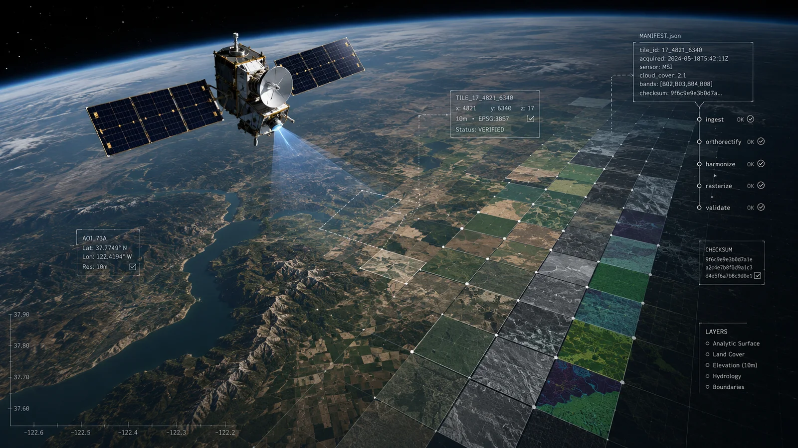
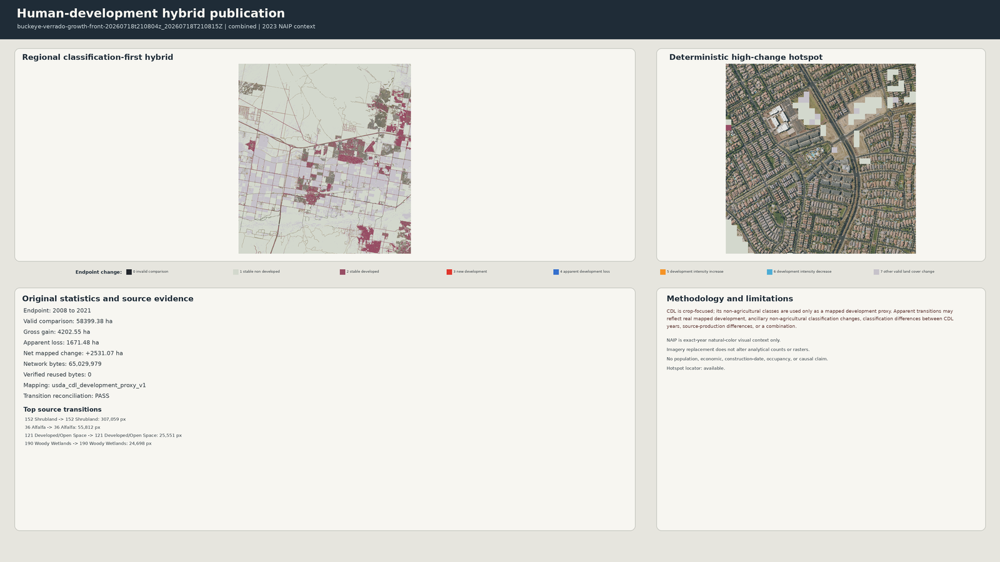
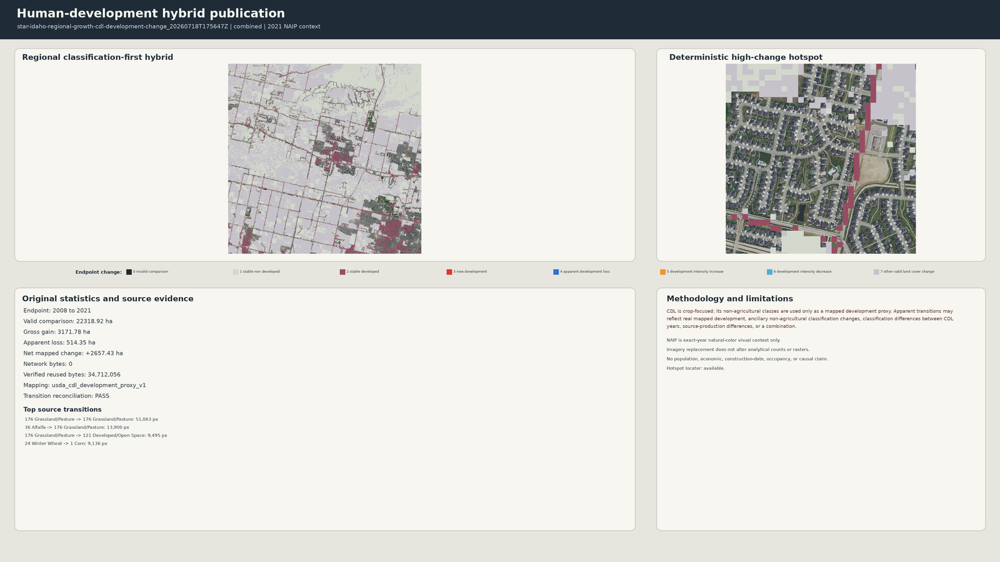

<div class="fr-home">

<section class="fr-hero" aria-labelledby="fr-hero-title">
  <div class="fr-hero__visual">
    
  </div>
  <div class="fr-hero__scrim" aria-hidden="true"></div>
  <div class="fr-hero__content">
    <p class="fr-eyebrow">Deterministic raster acquisition and harmonization</p>
    <h2 id="fr-hero-title">FasterRaster</h2>
    <p class="fr-hero__lead">Turn public raster sources into bounded, reproducible, and publication-ready geospatial workflows.</p>
    <p class="fr-hero__support">Compile source contracts, validate inputs, harmonize grids, and preserve the evidence required to reproduce every output.</p>
    <div class="fr-actions" aria-label="Primary actions">
      <a class="fr-button fr-button--primary" href="quickstart/">Get started</a>
      <a class="fr-button fr-button--secondary" href="examples/">Explore workflows</a>
      <a class="fr-button fr-button--text" href="https://github.com/dmsrsic/faster-raster">View on GitHub<span aria-hidden="true"> (external)</span></a>
    </div>
  </div>
  <p class="fr-hero__art-note">Conceptual illustration. Embedded labels are decorative; CLI output and signed evidence remain authoritative.</p>
</section>

<section class="fr-proof" aria-label="Why FasterRaster">
  <article>
    <p class="fr-proof__label">Source-aware</p>
    <p>Exact source contracts replace manual dataset searching.</p>
  </article>
  <article>
    <p class="fr-proof__label">Deterministic</p>
    <p>The same request produces stable plans, schemas, and manifests.</p>
  </article>
  <article>
    <p class="fr-proof__label">Auditable</p>
    <p>Checksums, receipts, validation, and provenance travel with every output.</p>
  </article>
</section>

<section class="fr-section fr-section--intro" markdown="1">

## Raster work should be reproducible by construction

Raster studies often hide consequential choices in notebooks, filenames, browser sessions, and local caches. FasterRaster moves those choices into explicit study contracts: source, year, extent, grid, resampling policy, network budget, and reuse behavior. It validates the contract before acquisition and fails closed when required evidence is missing.

The result is not just an image or array. It is a bounded workflow with the manifests, receipts, checksums, and provenance needed to inspect and reproduce what happened.

</section>

<section class="fr-section" markdown="1">

## One lifecycle from intent to evidence

<ol class="fr-lifecycle">
  <li><span>01</span><strong>Define</strong><p>Create a Markdown study workfile from a shipped template.</p></li>
  <li><span>02</span><strong>Validate</strong><p>Check schema, source years, extent, grid, and policy offline.</p></li>
  <li><span>03</span><strong>Plan</strong><p>Compile deterministic source, acquisition, and harmonization plans.</p></li>
  <li><span>04</span><strong>Cook</strong><p>Acquire only with explicit permission and enforced byte ceilings.</p></li>
  <li><span>05</span><strong>Inspect</strong><p>Review transactional outputs, receipts, checksums, and provenance.</p></li>
  <li><span>06</span><strong>Reuse</strong><p>Replay compatible evidence with strict zero-network verification.</p></li>
</ol>

[Understand the architecture](concepts.md){ .fr-inline-link }

</section>

<section class="fr-section" markdown="1">

## One real workfile-to-output record

The Star, Idaho example keeps intent, commands, the 25 MB ceiling, the
publication derivative, and its hashes connected:

```sh
fr validate examples/star-idaho-regional-growth-cdl-development-change.fr.md
fr plan examples/star-idaho-regional-growth-cdl-development-change.fr.md --out build/star-plan
fr cook examples/star-idaho-regional-growth-cdl-development-change.fr.md --reuse auto --no-open
fr inspect latest --verbose
```

The result uses CDL analytical years 2008, 2016, and 2021. The public evidence
records the output derivative and hashes; it does not retain enough evidence
to claim historical transfer bytes or runtime.

[Inspect the workfile, output, provenance, and scientific boundary](examples.md#complete-star-workflow-record){ .fr-inline-link }

</section>

<section class="fr-section" markdown="1">

## Unreleased index-guided classification

Current development preserves the broad NAIP–CDL classifier and adds
source-aware spectral indices plus explicit specialist classes. User-defined,
recommendation, and opt-in automatic modes retain formulas, calibration,
nested spatial selection, overlap arbitration, analytical COGs, receipts, and
inspection evidence.

[Read the index-guided classification guide](index-guided-classification.md){ .fr-inline-link }

</section>

<section class="fr-section fr-quickstart" markdown="1">

## A real offline start

The beta ships a small Meridian study that can be initialized, validated, and planned without contacting a raster service.

```sh
python3.12 -m venv .venv
. .venv/bin/activate
python -m pip install .

fr doctor --offline
fr templates list
mkdir -p studies
fr init studies/meridian.fr.md \
  --template human-development-cdl \
  --name meridian-cdl-development \
  --bbox -116.45 43.58 -116.35 43.68 \
  --years 2008 2016 2021
fr validate studies/meridian.fr.md
fr plan studies/meridian.fr.md --offline --out build/meridian-plan
```

These commands make no network requests. Review the generated workfile and plan before enabling any live acquisition.

Without verified cache evidence, the offline plan records exact-year coverage
as `NOT_CHECKED` and requires an online re-plan before execution. It does not
claim that coverage was verified.

[Follow the five-minute quickstart](quickstart.md){ .fr-button .fr-button--primary }

</section>

<section class="fr-section" markdown="1">

## Publication examples with their evidence boundaries

<div class="fr-example-grid">
  <figure>
    
    <figcaption><strong>Buckeye-Verrado, Arizona.</strong> CDL analytical years 2008, 2016, and 2021 with explicitly selected 2023 NAIP visual context.</figcaption>
  </figure>
  <figure>
    
    <figcaption><strong>Star, Idaho.</strong> CDL analytical years 2008, 2016, and 2021 with 2021 NAIP visual context.</figcaption>
  </figure>
</div>

Both examples are documentation-sized derivatives of checksum-verified local publications. They use a crop-focused CDL mapped-development proxy; they are not authoritative urbanization, population, construction, economic, or causal evidence.

[Open the examples and provenance notes](examples.md){ .fr-inline-link }

</section>

<section class="fr-section fr-boundary" markdown="1">

<div>

## Public beta scope

The `v1.0.0-beta.4` release adds source-aware index-guided hybrid classification to deterministic workfiles and plans, strict exact-year validation, bounded local execution, transactional handoffs, checksum-bound reuse, implemented USDA CDL acquisition, USGS NAIP visual context, the NAIP–CDL broad classifier, and auditable interactive source-contract repair.

[Review supported sources](supported-sources.md){ .fr-inline-link }

</div>

<div>

## Explicit limitations

Ubuntu with Python 3.12 is the public CI target. Source coverage depends on provider geography, year, catalog state, and service availability. The beta does not ship an authoritative general land-cover model, authoritative urbanization model, causal model, paid-source integration, or cluster execution service.

[Read all known limitations](limitations.md){ .fr-inline-link }

</div>

</section>

<section class="fr-section fr-explore" markdown="1">

## Go deeper

<div class="fr-link-grid">
  <a href="determinism/"><strong>Determinism and reuse</strong><span>Content-bound plans, evidence, and compatibility.</span></a>
  <a href="network-byte-budgets/"><strong>Network and byte budgets</strong><span>Explicit opt-in and bounded transfer rules.</span></a>
  <a href="human-development/"><strong>Human-development workflow</strong><span>Method, interpretation boundary, and outputs.</span></a>
  <a href="index-guided-classification/"><strong>Index-guided classification</strong><span>Source-aware indices and specialist refinements.</span></a>
  <a href="errors-recovery/"><strong>Errors and recovery</strong><span>Fail-closed behavior and corrective paths.</span></a>
</div>

</section>

</div>
